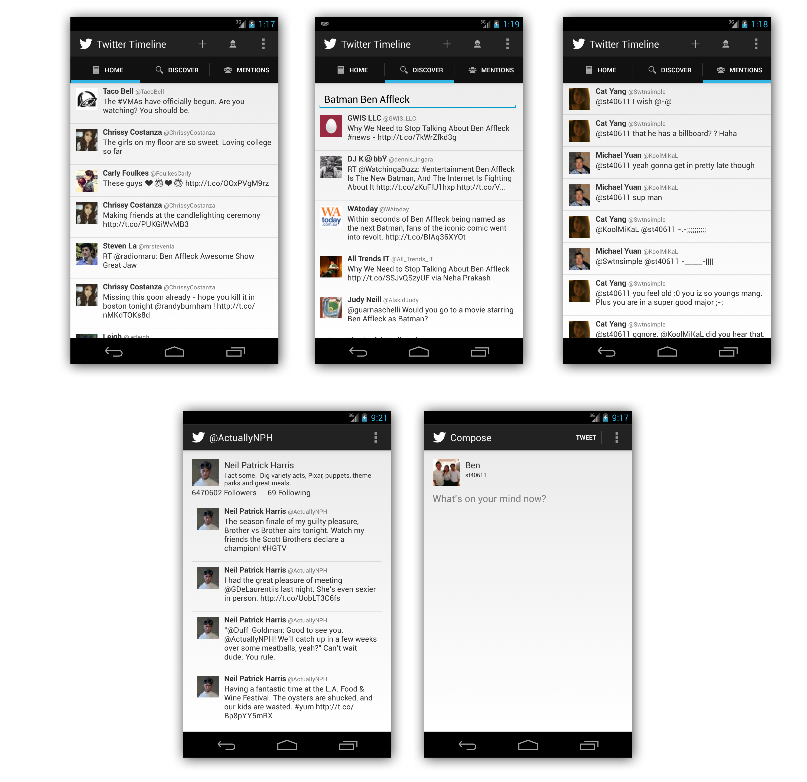

A simple Android Twitter client based off the SimpleTwitterClient & SimpleRESTClient written by thecodepath.

The following features are all implemented:
- User can view last 25 tweets from their home timeline
- User can compose a new tweet
- User can view their home timeline tweets
- User can also view other users' timeline tweets by tapping one of their tweets
- User can view the recent mentions of their username
- User can view their profile
- User can search / discover new Tweets with a query string

